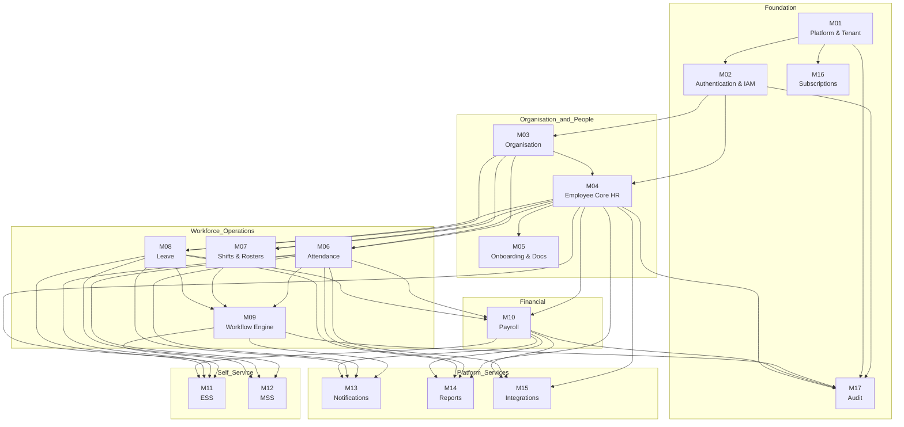

# Module Dependency Matrix

> Source: TSA §8, §53 — documented module relationships and implementation sequence only.
> No undocumented dependencies inferred.

---

## 1. Dependency Table

| Module | Depends On (must exist first) | Required Before (blocks these) | Critical? |
|--------|-------------------------------|--------------------------------|-----------|
| **M01** Platform & Tenant | — | M02, M16 | Yes — foundation |
| **M02** Authentication & IAM | M01 | All other modules | Yes — all modules require auth |
| **M03** Organisation | M01, M02 | M04, M06, M07, M08 | Yes — employee placement |
| **M04** Employee Core HR | M01, M02, M03 | M05, M06, M07, M08, M10, M11, M14, M15 | Yes — payroll, attendance anchored to employees |
| **M05** Onboarding & Docs | M04 | — | No — parallel to ops modules |
| **M06** Attendance | M03, M04 | M09 (corrections), M10, M11, M12, M14, M15 | Yes — payroll depends on attendance |
| **M07** Shifts & Rosters | M03, M04 | M09 (shift swaps) | No — enhances M06 |
| **M08** Leave | M03, M04 | M09, M10, M11, M12 | Yes — payroll deductions from leave |
| **M09** Workflow / Approval Engine | M06, M07, M08 | M10 (approval flow), M12 (MSS actions) | Yes — payroll approval uses M09 |
| **M10** Payroll | M04, M06, M08 | M11 (payslips), M14 (payroll reports) | Yes — downstream: payslips, exports |
| **M11** ESS | M04, M06, M08, M10 | — | No — read-aggregation layer |
| **M12** MSS | M06, M08, M09 | — | No — read-aggregation layer |
| **M13** Notifications | M09, M06, M08, M10 | — | No — event consumer |
| **M14** Reports | M04, M06, M08, M10 | — | No — reporting layer |
| **M15** Integrations | M04, M06, M10 | — | No — connector layer |
| **M16** Subscriptions | M01 | Feature entitlement checks in all modules | Yes — entitlements gate feature access |
| **M17** Audit | M02, M09, M10, M04 | — | Yes — must be active from Phase 2 |

---

## 2. Mermaid Dependency Graph

> Arrows indicate "depends on" (source requires target).



---

## 3. Critical Path

The critical path to a working payroll pipeline (the primary product value):

```
M01 → M02 → M03 → M04 → M06 → M09 → M10
                 → M08 ↗
```

| Step | Module | Reason |
|------|--------|--------|
| 1 | M01 | Tenants must exist before any other data |
| 2 | M02 | Authentication required for all operations |
| 3 | M03 | Organisation structure required to assign employees |
| 4 | M04 | Employee records required for attendance + payroll |
| 5 | M06 | Attendance records feed payroll calculation |
| 5 | M08 | Leave records feed payroll deductions |
| 6 | M09 | Approval workflow required for payroll approval |
| 7 | M10 | Payroll can now run with all inputs available |

---

## 4. Optional / Non-Blocking Modules

These modules do NOT block the critical path and can be developed in parallel after their dependencies are met:

| Module | Can Start After | Parallelisable With |
|--------|----------------|---------------------|
| M05 Onboarding | M04 | M06, M07, M08 |
| M07 Shifts | M03, M04 | M08, M05 |
| M11 ESS | M10 | M12, M13, M14 |
| M12 MSS | M09 | M11, M13, M14 |
| M13 Notifications | M09 | M11, M12, M14 |
| M14 Reports | M10 | M11, M12, M13 |
| M15 Integrations | M10 | M11, M12, M13, M14 |
| M16 Subscriptions | M01 | M02 |

---

## 5. Cross-Cutting Dependencies (non-module)

These are not modules but must be in place before implementation begins:

| Concern | Required By | Phase |
|---------|-------------|-------|
| PostgreSQL RLS policies | All tenant-owned tables | Phase 2 |
| Transactional Outbox | Any event publishing (M06, M08, M10, M13…) | Phase 2 |
| Audit Interceptor | All Restricted/Secret mutations | Phase 2 |
| Feature Flag / Entitlement Service | All plan-gated features | Phase 2 |
| OpenTelemetry SDK | All services | Phase 2 |
| Rate Limiter (Redis) | All API endpoints | Phase 2 |
| Idempotency key table | All POST/PUT mutations | Phase 2 |
