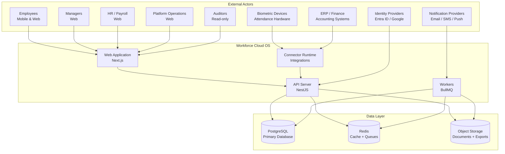
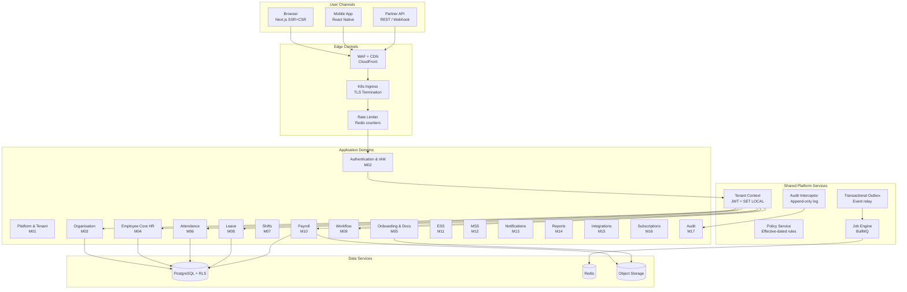
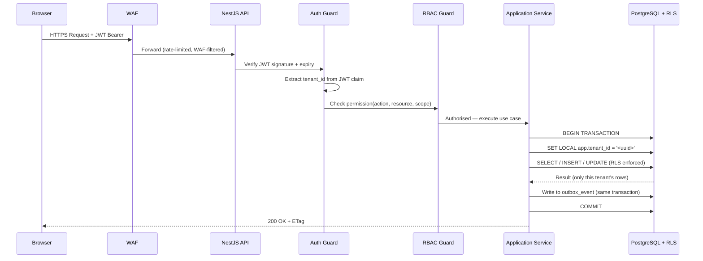
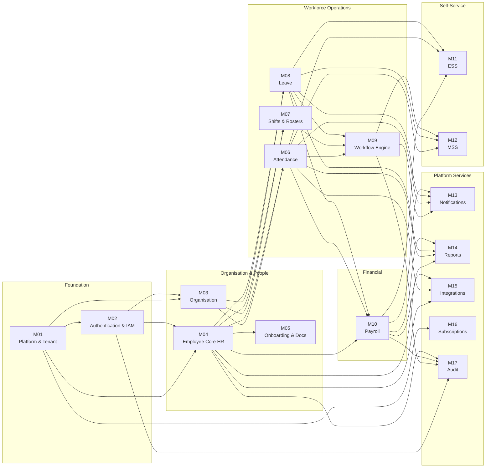
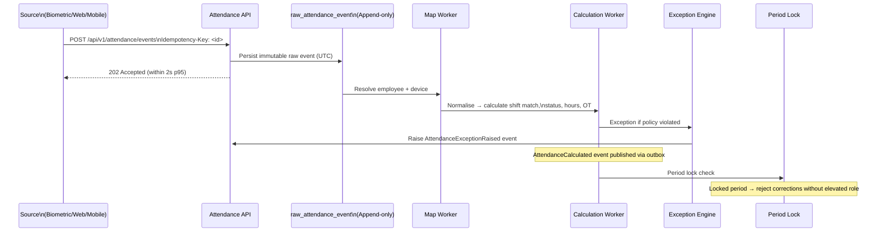
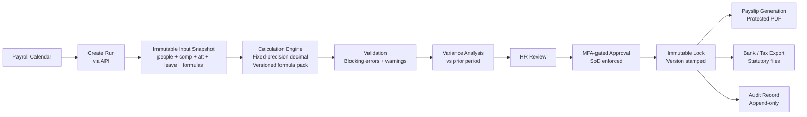
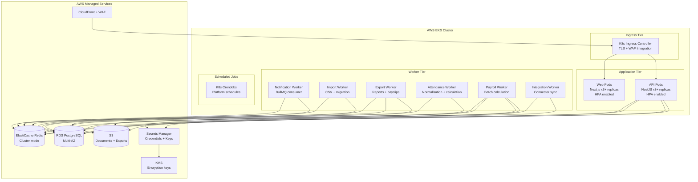
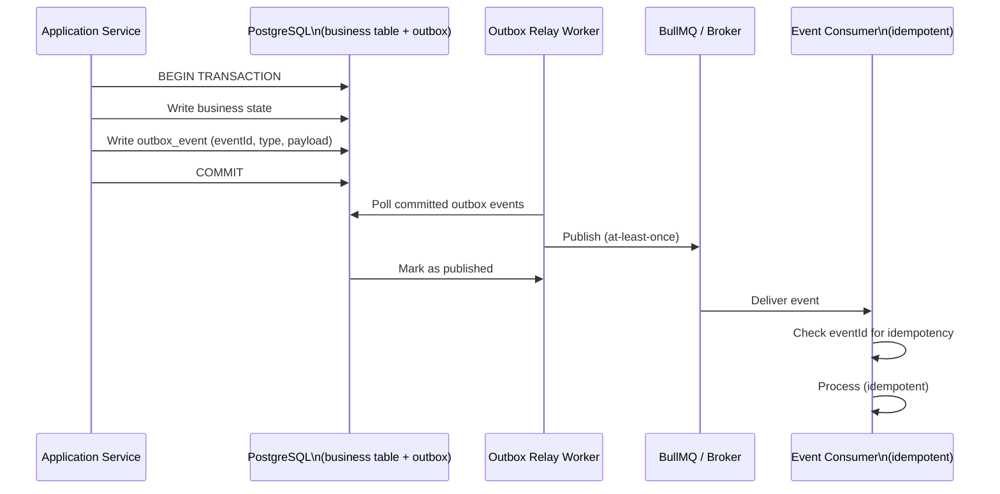
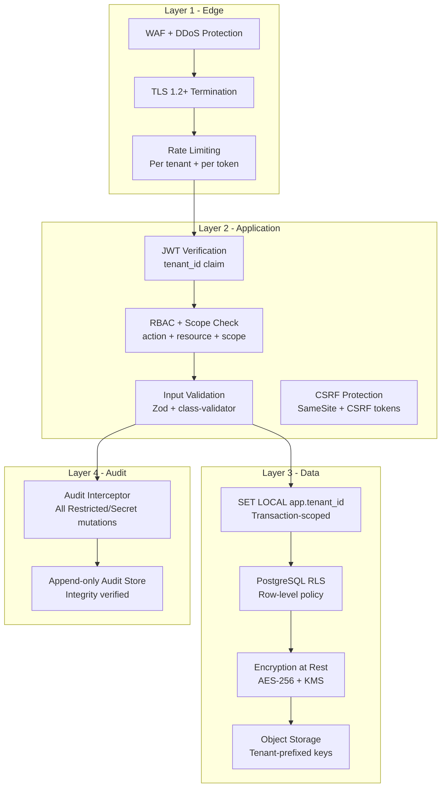
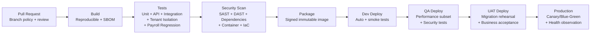

# System Architecture

> Based exclusively on: `Workforce_Cloud_OS_MVP_Technical_Solution_Architecture.pdf` (TSA), §3–§12, §36.

---

## 1. Architecture Statement

> "One deployable platform, clearly owned domains, tenant isolation by design, deterministic payroll, auditable workflows and cloud-portable operations."
> — TSA §58

**Pattern:** Modular Monolith deployed on Kubernetes
**Primary cloud:** AWS (EKS reference); Azure and GCP equivalents mapped
**Data:** Shared PostgreSQL database + shared schema + PostgreSQL RLS (ADR-002)

---

## 2. High-Level System Context

---

## 3. Layered Logical Architecture

---

## 4. Multi-Tenant Request Flow

---

## 5. Domain Module Boundaries

---

## 6. Attendance Pipeline

---

## 7. Payroll Pipeline

---

## 8. Kubernetes Deployment Topology

---

## 9. Event Architecture (Transactional Outbox)

---

## 10. Security Architecture Layers

---

## 11. CI/CD Pipeline

---

## 12. Component Descriptions

| Component | Technology | Responsibility |
|-----------|-----------|---------------|
| Web | Next.js (App Router) | SSR + CSR for all user personas; route groups `(platform)`, `(tenant)`, `(employee)`, `(auth)` |
| API | NestJS (modular monolith) | REST endpoints, application services, domain logic, outbox writes |
| Workers | BullMQ consumers | Async processing: notifications, imports, exports, attendance normalisation, payroll calculation, connector sync |
| Connector Runtime | NestJS (isolated) | Integration adapters for biometric devices, ERP, bank, identity providers |
| PostgreSQL | Managed RDS | Authoritative transactional store; RLS enforces tenant isolation; PITR backups |
| Redis | Managed ElastiCache | Cache (tenant-keyed + TTL), distributed locks, BullMQ queue state |
| Object Storage | AWS S3 | Encrypted documents, exports, payslips; tenant-prefixed; lifecycle policies |
| Outbox Relay | Background job | Polls committed outbox events; publishes to BullMQ; ensures at-least-once delivery |
| WAF + CDN | CloudFront + AWS WAF | DDoS protection, TLS, rate limiting at edge |
| Secrets Manager | AWS Secrets Manager + KMS | All secrets and encryption keys; rotated per policy |
| OpenTelemetry | OTel SDK | Vendor-neutral traces, metrics, logs across all components |
